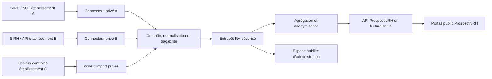

# Architecture de ProspectivRH

## État actuel

Le prototype est une application React/TypeScript. Le moteur situé dans
`lib/gpec-engine.ts` lit une feuille `Trame`, normalise les lignes et calcule les
indicateurs utilisés par les tableaux de bord.

La version GitHub Pages est entièrement statique. Elle peut afficher les données
de démonstration et effectuer des calculs dans le navigateur, mais elle ne possède
ni base partagée ni capacité d’écriture distante.

## Architecture cible multi-établissements

## Responsabilités

| Composant | Responsabilité | Exposition |
| --- | --- | --- |
| Connecteurs | Extraire les données autorisées | Privée |
| Zone d’import | Réception temporaire et contrôles | Privée |
| Entrepôt sécurisé | Historisation et calculs détaillés | Privée |
| Pipeline de publication | Agrégation, seuils, anonymisation | Privée |
| API ProspectivRH | Servir uniquement les données publiables | Lecture seule |
| Portail GitHub Pages | Visualisation et scénarios sans secret | Publique |

## Contrat de données futur

Chaque établissement devra fournir un flux documenté comprenant au minimum :

- identifiant technique pseudonymisé ;
- établissement et structure de rattachement ;
- année de naissance ou tranche d’âge selon le niveau autorisé ;
- statut, corps, mission et famille professionnelle normalisés ;
- date de référence et version du référentiel ;
- indicateurs de qualité et provenance de chaque lot.

Les champs nominatifs ne doivent pas être nécessaires au portail prospectif.

## Gouvernance des modifications

- `main` représente la version publiable.
- Les évolutions passent par une branche et une *pull request*.
- GitHub Actions vérifie le code et publie le frontend statique.
- Les mises à jour de données institutionnelles ne passent pas par GitHub : elles
  doivent être réalisées par le pipeline privé et auditable.

## Limite importante de GitHub Pages

GitHub Pages héberge des fichiers statiques. Il ne peut pas conserver des secrets,
ouvrir une connexion SQL ni exécuter un backend métier. La future API et les
connecteurs devront donc être hébergés séparément dans une infrastructure adaptée
aux exigences de sécurité et de protection des données.
